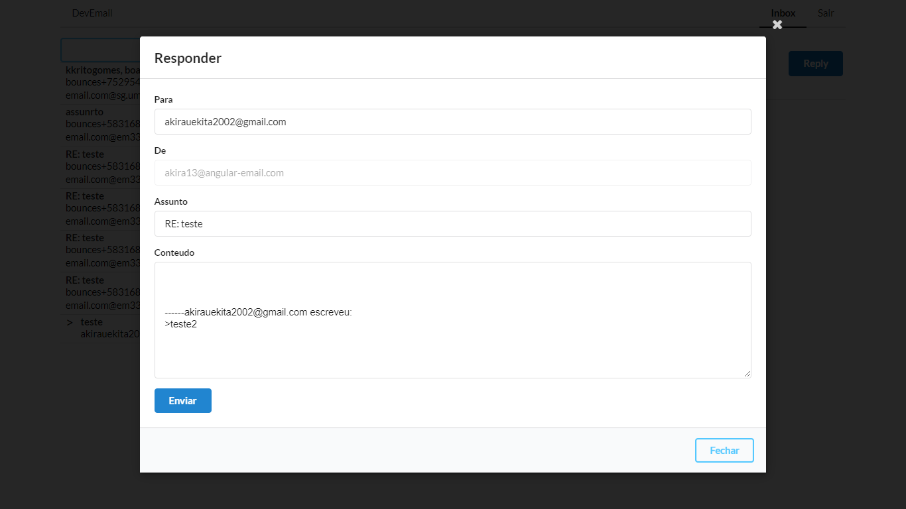

# Email
## Projeto
Esse projeto para fins de estudo sobre angular consumindo uma api
100% funcional enviando, recebendo e respondendo emails 
Se puderem venham utilizar <a href="https://email-ten.now.sh/" target="_blank">Clique aqui</a>
## Adendo essa api não é de minha autoria 

## Funcionalidades
### Enviar Emails
### Receber Emails
### Responder Emails
### Visualizar Emails
### Login
### Cadastrar

## Telas
### Inicio

### Cadastro

### Login

### Inbox

### Email

### Enviando Emails

### Respondendo Emails

